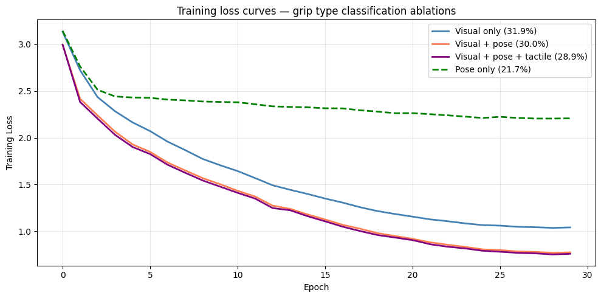

# Direction B: Grip Type Classification — Results Summary

## Experiment Setup

**Task**: Predict grip type (28 classes) from pre-contact egocentric video and hand pose  
**Dataset**: OpenTouch — 1,979 train / 259 val / 263 test samples  
**Model**: OpenTouch-DINOv3-B16-Classify  
**Training**: 30 epochs, AdamW, lr=3e-3, cosine annealing, batch size 64, T4 GPU  
**Evaluation**: Top-1 accuracy and macro F1 on held-out test split  

## Results

| Run | Modalities | Test Accuracy | Macro F1 | Train Loss (ep. 29) |
|-----|-----------|:-------------:|:--------:|:-------------------:|
| 1 | Visual only | **31.9%** | 0.169 | 1.041 |
| 2 | Visual + pose | 30.0% | 0.135 | 0.773 |
| 3 | Visual + pose + tactile | 28.9% | 0.144 | 0.758 |
| 4 | Pose only | TBD | TBD | TBD |

*Random chance baseline: 3.6% (1/28 classes)*

## Key Finding: Overfitting with Additional Modalities

A striking pattern emerges: adding more modalities consistently **lowers test accuracy** despite **lowering training loss**. The visual-only model achieves the best test accuracy (31.9%) while the full visual+pose+tactile model has the lowest training loss (0.758) but worst test accuracy (28.9%).

This is a classic overfitting signature. The frozen DINOv3 visual encoder provides strong generalizable features out of the box, while the learned pose and tactile encoders — trained from scratch on ~1,979 samples across 28 classes — overfit rather than generalize at 30 epochs.

**Implications for next steps:**
- Longer training (100 epochs) with regularization for the learned encoders
- Per-encoder learning rate scheduling (lower LR for pose/tactile encoders)
- Stronger data augmentation for pose and tactile streams
- The training/test loss gap motivates the pose-only ablation (Run 4) — if pose-only accuracy is near chance, the pose encoder is adding noise rather than signal

## Training Loss Curves

All three runs show consistent convergence. The multimodal models converge to lower training loss but generalize worse — the gap between training loss and test accuracy widens with each added modality.

## Connection to Project Goals

The accuracy gap between Run 1 (visual only, 31.9%) and Run 3 (visual + pose + tactile, 28.9%) does not yet demonstrate the expected upper bound advantage of tactile signals. This is attributed to insufficient training at 30 epochs rather than a fundamental limitation of the approach. The next steps section of the midterm report outlines a longer training run and improved fusion strategy.

The **headroom for the generative model** — the gap between pre-contact-only prediction and the tactile-informed upper bound — will be re-evaluated after 100-epoch runs. The current results motivate the approach by showing that even a simple visual baseline significantly outperforms chance (31.9% vs 3.6%), confirming that pre-contact signals carry meaningful grip type information.