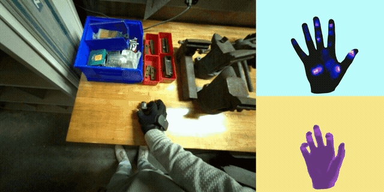

# OPENTOUCH: Bringing Full-Hand Touch to Real-World Interaction
[Project](https://opentouch-tactile.github.io/) | [Paper](https://arxiv.org/abs/2512.16842) | [Hardware](https://wiresens-gloves.vercel.app/) | [Dataset](scripts/download_data.sh)

OpenTouch is an egocentric in-the-wild dataset and cross-modal learning framework for visual (RGB), tactile (pressure), and hand-pose modalities.

## Dataset

The OpenTouch data is organized as synchronized multimodal recordings:
- egocentric RGB video streams
- full hand tactile pressure maps
- hand pose

The dataset is hosted on Google Drive. We use [gdown](https://github.com/wkentaro/gdown) to download all files:

```bash
pip install gdown
bash scripts/download_data.sh
cd data && unzip final_annotations.zip && cd ..
```
See [`scripts/download_data.sh`](scripts/download_data.sh) for the full list of Google Drive file IDs.

## Environment Setup

```bash
conda create -n opentouch python=3.10
conda activate opentouch
pip install -e .               
```

### MANO Mesh Visualization (Optional)

The rendering scripts require extra dependencies:

```bash
git submodule update --init --recursive
pip install -e ".[rendering]"
cd EasyMocap && pip install -e . && cd ..
```

You also need the MANO hand model:

1. Download `MANO_RIGHT.pkl` from the [MANO project](https://mano.is.tue.mpg.de/)
2. Place it in `preprocess/scratch/MANO_RIGHT.pkl`

```bash
# Generate a synchronized visualization from an HDF5 recording:
python preprocess/build_demo.py \
    --hdf5 data/fablab_ml_p1.hdf5 \
    --demo-id demo_05 \
    --fps 30
```



Example output: simple RGB+tactile view and tri-view with MANO/pose rendering.

Output path: `data/<dataset_name>/<demo_id>/combined.mp4`

### Convert HDF5 to Arrow Dataset
```bash
# Retrieval dataset
python build_retrieval_data.py \
    --input-dir data \
    --output-dir preprocessed_data/train_dataset

# Classification dataset
python build_label_data.py \
    --input-dir data \
    --output-dir preprocessed_data/classification_peak \
    --label-mapping-path final_annotations \
    --label-column action \
    --frame-index-column peak_idx \
    --temporal-radius 10
```
## Model Backbone
The default visual backbone is DINOv3 ViT-B/16 (`facebook/dinov3-vitb16-pretrain-lvd1689m`).
Access to this model may require approval from Meta. Please refer to [DINOv3](https://github.com/facebookresearch/dinov3) for more details.

## Retrieval
```bash
bash scripts/train.sh
```
Or run directly:

```bash
CUDA_VISIBLE_DEVICES=0 python -m opentouch_train.main \
    --train-data preprocessed_data/train_dataset \
    --model OpenTouch-DINOv3-B16-Retrieval \
    --task-type v2t \
    --batch-size 128 \
    --lr 1e-4 \
    --epochs 300 \
    --precision amp \
    --workers 8 \
    --sequence-length 20
```

If you want to train with multiple GPUs, use distributed data parallel (DDP): please see [`scripts/train_multigpu.sh`](scripts/train_multigpu.sh) for the full reference configuration.

## Task Types
Set `--task-type` to choose the retrieval task:
| Task Type | Description |
| --- | --- |
| `v2t` | Visual $\leftrightarrow$ tactile |
| `p2t` | Pose $\leftrightarrow$ tactile |
| `v2p` | Visual $\leftrightarrow$ pose |
| `vp2t` | Visual + pose $\leftrightarrow$ tactile |
| `tp2v` | Tactile + pose $\leftrightarrow$ visual |
| `vt2p` | Visual + tactile $\leftrightarrow$ pose |


## Classification
Train action or grip classifiers on top of the same encoders:

```bash
bash scripts/train_classifier.sh
```

Or run directly:

```bash
CUDA_VISIBLE_DEVICES=0 python -m opentouch_train.classification_main \
    --train-data preprocessed_data/classification_peak \
    --model OpenTouch-DINOv3-B16-Classify \
    --task action \
    --modalities visual tactile \
    --batch-size 64 \
    --lr 3e-3 \
    --epochs 500 \
    --precision amp
```

### Classification Options

| Flag | Description |
| --- | --- |
| `--task` | Classification task: `action` or `grip` |
| `--modalities` | Input modalities: `visual`, `tactile`, `pose` (any combination).|

## Evaluation

Model name, task type, and modalities are auto-detected from the checkpoint or `params.txt`.

### Retrieval

```bash
bash scripts/eval.sh logs/<run_name>/checkpoints/epoch_<N>.pt
```

### Classification

```bash
bash scripts/eval_classifier.sh logs/<run_name>/checkpoints/epoch_<N>.pt
```

## Citation

If you find this work helpful, please consider citing:

```bibtex
@article{song2025opentouch,
  title={OPENTOUCH: Bringing Full-Hand Touch to Real-World Interaction},
  author={Song, Yuxin Ray and Li, Jinzhou and Fu, Rao and Murphy, Devin and Zhou, Kaichen and Shiv, Rishi and Li, Yaqi and Xiong, Haoyu and Owens, Crystal Elaine and Du, Yilun and others},
  journal={arXiv preprint arXiv:2512.16842},
  year={2025}
}
```

## Acknowledgments

This codebase builds on [OpenCLIP](https://github.com/mlfoundations/open_clip).
